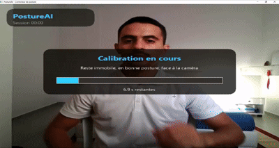
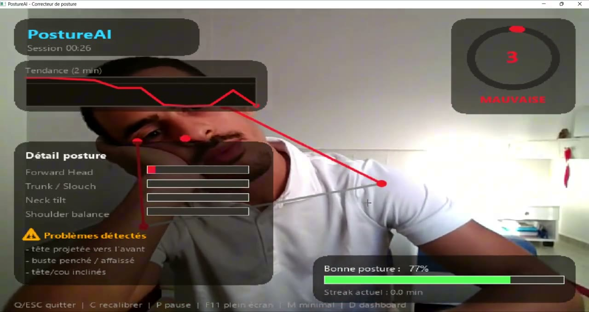
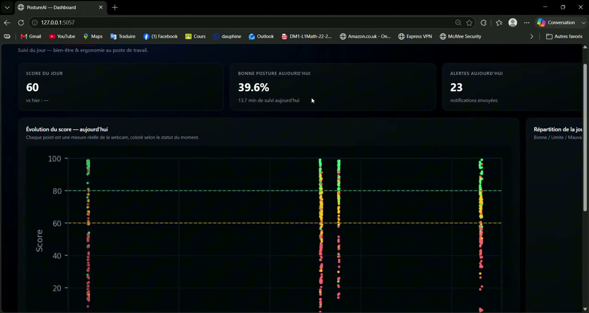

# PostureAI — Real-Time Posture Assistant

A local, privacy-first computer-vision assistant that analyzes head, neck, trunk and shoulder posture in real time, provides personalized calibration, raises smart alerts when posture degrades, and displays session statistics in a local dashboard.

> PostureAI is an ergonomics and well-being project. It is not a medical device.

## Demo





## Demo Video
🎥 [Watch the PostureAI demo video](assets/postureai_demo.mp4)

## Screenshots

### Real-Time Posture Tracking



### Local Dashboard



## Overview

PostureAI is a desktop posture-correction assistant built with Python, OpenCV and MediaPipe.

The application uses a webcam to detect posture-related body landmarks and evaluates the user's posture through a personalized score from 0 to 100. It combines several posture indicators, stabilizes the measurements over time, alerts the user when poor posture persists, and provides a local dashboard for monitoring the current session and daily posture statistics.

All webcam processing is performed locally. Images and videos are not uploaded or stored.

## Project Context

People who spend long periods working, studying or gaming in front of a computer can gradually adopt poor sitting posture without noticing it.

Many posture-monitoring approaches rely on fixed thresholds or cloud-based video processing. PostureAI was designed instead around:

- Local webcam processing
- Personalized calibration
- Multi-criteria posture scoring
- Real-time feedback
- Privacy-first operation
- A lightweight local dashboard

## Problem

The main challenges addressed by PostureAI are:

- Detecting posture from a normal seated desktop position
- Avoiding dependence on a strict side-view camera angle
- Adapting thresholds to each user's natural posture
- Reducing unstable score changes caused by small movements
- Alerting the user without excessive notifications
- Providing useful daily posture feedback
- Keeping webcam data private and local

## Solution

PostureAI uses MediaPipe landmarks and OpenCV video processing to analyze posture in real time.

At startup, the user performs a short seated calibration. The system then compares live posture measurements with the user's personal baseline and calculates a weighted posture score.

The application detects persistent posture degradation, displays visual feedback in the camera interface, sends local alerts, and stores only numerical posture/session metrics in SQLite for the dashboard.

## Key Features

- Real-time webcam posture analysis
- MediaPipe-based body landmark detection
- Personalized seated calibration
- Posture score from 0 to 100
- Forward-head detection
- Trunk lean / slouch detection
- Neck-tilt detection
- Shoulder-asymmetry detection
- Temporal smoothing and status stabilization
- Camera-framing validation
- Live list of detected posture problems
- Always-on-top posture alert overlay
- Windows desktop notifications
- Native Windows alert sound
- System-tray controls
- Pause / Resume support
- Full-screen presentation mode
- Minimal HUD mode
- Live posture trend in the camera interface
- Smart Break suggestions
- 20-20-20 reminder support
- Good-posture streak tracking
- Local Flask dashboard
- Live dashboard refresh during a session
- SQLite persistence for posture metrics
- Server-side Matplotlib charts
- Offline-capable dashboard
- No webcam image or video storage

## Posture Scoring

The global posture score combines four indicators:

```text
Forward Head        40%
Trunk Lean / Slouch 25%
Neck Tilt           20%
Shoulder Asymmetry  15%
```

The score is calculated as:

```text
score = 0.40 × forward_head_score
      + 0.25 × trunk_lean_score
      + 0.20 × neck_tilt_score
      + 0.15 × shoulder_asymmetry_score
```

Posture status:

```text
GOOD     >= 80
WARNING  60–79
BAD      < 60
```

A new status must persist briefly before becoming official, which reduces rapid GOOD/WARNING/BAD flickering caused by small movements.

## Processing Pipeline

```text
Webcam Frame
     ↓
MediaPipe Landmark Detection
     ↓
Camera / Landmark Validation
     ↓
Personal Calibration Baseline
     ↓
Posture Metric Extraction
     ↓
Forward Head
Trunk Lean / Slouch
Neck Tilt
Shoulder Asymmetry
     ↓
Weighted Posture Score
     ↓
Temporal Smoothing
     ↓
GOOD / WARNING / BAD Classification
     ↓
HUD + Alerts + Session Statistics
     ↓
SQLite Local Database
     ↓
Flask Dashboard + Matplotlib Charts
```

## Tech Stack

### Computer Vision

- OpenCV
- MediaPipe
- NumPy

### Application

- Python
- Pillow
- pystray
- plyer
- winsound

### Dashboard

- Flask
- Matplotlib
- HTML / CSS

### Data Storage

- SQLite

## Project Structure

```text
PostureAI/
│
├── README.md
├── GUIDE.md
├── main.py
├── requirements.txt
├── run.bat
├── .gitignore
│
├── assets/
│   ├── postureai_demo.mp4
│   ├── posture_tracking.png
│   └── dashboard.png
│
├── data/
│   └── .gitkeep
│
├── output/
│   └── .gitkeep
│
└── posture_ai/
    ├── __init__.py
    ├── alerts.py
    ├── app_controller.py
    ├── camera_worker.py
    ├── config.py
    ├── database.py
    ├── posture_engine.py
    ├── session_stats.py
    ├── sound_utils.py
    ├── tray_icon.py
    ├── ui_render.py
    │
    └── dashboard/
        ├── __init__.py
        ├── charts.py
        ├── server.py
        ├── static/
        │   └── .gitkeep
        └── templates/
            └── index.html
```

> The local virtual environment (`venv/`), Python cache files and the local SQLite database are intentionally excluded from GitHub.

## How to Run the Project

### 1. Clone the repository

```bash
git clone https://github.com/arefbakali/PostureAI.git
cd PostureAI
```

### 2. Create a virtual environment

On Windows:

```powershell
python -m venv venv
```

### 3. Activate the virtual environment

```powershell
.\venv\Scripts\Activate.ps1
```

If PowerShell blocks activation, you can use Command Prompt instead:

```bat
venv\Scripts\activate
```

### 4. Install dependencies

```powershell
pip install -r requirements.txt
```

### 5. Run PostureAI

```powershell
python main.py
```

You can also launch the project on Windows using:

```text
run.bat
```

## First Launch and Calibration

1. Sit normally in front of your screen.
2. Keep your face and shoulders visible to the webcam.
3. Stay in a comfortable good posture during the calibration period.
4. Wait for calibration to complete.
5. PostureAI starts displaying the real-time score and posture indicators.

Recalibration can be triggered at any time with the `C` key.

## Local Dashboard

The dashboard starts automatically with the application.

Open it using:

```text
http://127.0.0.1:5057
```

You can also press `D` in the webcam window or open it from the system-tray menu.

The dashboard includes:

- Daily posture score
- Good-posture percentage
- Number of alerts
- Score evolution during the day
- GOOD / WARNING / BAD distribution
- Daily posture objective
- Daily posture advice
- Best session information
- Live refresh while PostureAI is running

## Keyboard Shortcuts

| Key | Action |
|---|---|
| `C` | Recalibrate |
| `P` | Pause / Resume |
| `D` | Open dashboard |
| `F11` or `F` | Toggle full-screen mode |
| `M` | Toggle minimal HUD |
| `Q` or `ESC` | Quit and close the session |

## Requirements

- Windows recommended
- Python 3.11 recommended
- Webcam
- Python dependencies listed in `requirements.txt`

Main dependencies:

```text
opencv-python
mediapipe
numpy
flask
pystray
Pillow
plyer
matplotlib
```

## Privacy

PostureAI follows a local-first approach.

- Webcam frames are processed on the user's computer.
- Webcam images are not saved.
- Webcam videos are not recorded.
- Webcam data is not sent to a cloud service.
- Only numerical posture and session metrics are stored locally.
- Local metrics are stored in `data/postureai.db`.

## Limitations

- Posture estimation quality depends on webcam position, lighting and landmark visibility.
- Calibration quality affects subsequent posture scoring.
- The application is primarily designed for a seated desktop setup.
- Windows provides the most complete experience for native notifications, sound and system-tray integration.
- PostureAI provides ergonomic feedback and should not be used for medical diagnosis.

## Future Improvements

- Improve robustness across different camera angles
- Improve low-light landmark detection
- Add optional long-term analytics
- Add multi-user profiles
- Add configurable posture goals
- Improve alert personalization
- Add automated tests
- Add CI/CD
- Package the application as a Windows executable
- Improve performance on lower-end computers

## Documentation

For detailed calibration instructions, posture-scoring methodology, phone-camera setup and troubleshooting, see:

[`GUIDE.md`](GUIDE.md)

## Author

**Aref Bak Ali**  
AI, Data Science & Agentic AI Student  
GitHub: https://github.com/arefbakali
